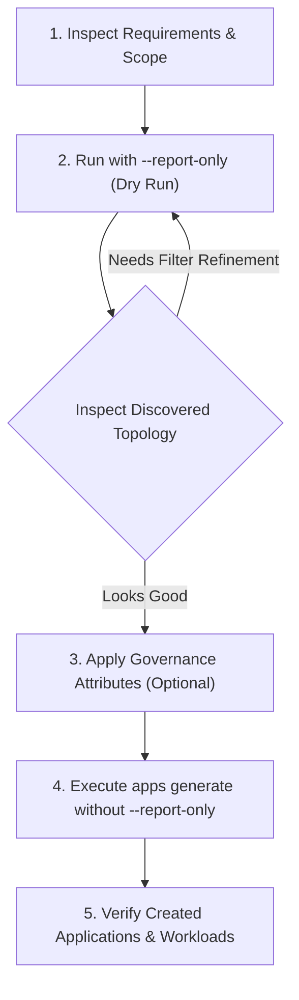

# App Hub App Creator Skill

This skill guides agents through using the `apphub-app-creator` CLI and HTTP daemon to discover Google Cloud resources and manage Google Cloud [App Hub](https://cloud.google.com/app-hub/docs/overview) Applications, Services, and Workloads.

---

## 1. Overview & Concepts

**Google Cloud App Hub** organizes cloud resources into a business-centric topology:
- **Application**: A logical grouping of services and workloads representing a functional application.
- **Service**: A functional unit providing an endpoint (e.g., Cloud Run Service, Forwarding Rule, Storage Bucket, Agent Registry MCP Server).
- **Workload**: A computational deployment running application logic (e.g., GKE Deployment/StatefulSet/DaemonSet/CronJob, Cloud Run Job, Compute Instance Group).
- **Discovered Services & Discovered Workloads**: App Hub's automatic discovery inventory from which services and workloads are registered into applications.

`apphub-app-creator` automates the discovery of resources via Cloud Asset Inventory (CAIS), Cloud Logging, and GKE, finds their matching Discovered Services/Workloads in App Hub, and registers them into structured App Hub Applications.

---

## 2. Prerequisites & Authentication

### IAM Permissions
Ensure the active GCP identity has:
- `roles/apphub.admin` or `roles/apphub.editor` on the management project.
- `roles/cloudasset.viewer` on the target `--parent` (project or folder).
- `roles/logging.viewer` (if using Cloud Logging label discovery).
- `roles/resourcemanager.tagViewer` (if using tag-based discovery).

### Local Authentication
```bash
gcloud auth application-default login
```

### Building Binary
If the binary is not in `$PATH`, build it from the repository root:
```bash
go build -o apphub-app-creator ./cmd/apphub-app-creator/apphub-app-creator.go
```

---

## 3. Command Hierarchy & Global Flags

```
apphub-app-creator
├── apps
│   ├── generate    # Discovers resources and generates App Hub Applications
│   └── delete      # Deletes App Hub Applications across regions
├── server          # Runs HTTP daemon for REST API requests and Web UI
├── docs            # Generates markdown documentation for CLI commands
└── version         # Displays version and build details
```

### Global Flags (Inherited by all commands)
| Flag | Type | Description |
| :--- | :--- | :--- |
| `--parent` | `string` | **Required for `generate`**. Scope of CAIS search: `projects/{PROJECT_ID}` or `folders/{FOLDER_ID}`. |
| `--locations` | `stringArray` | Target GCP locations to filter search and manage App Hub apps (e.g., `--locations us-central1 --locations global`). Can be repeated. |
| `--management-project` | `string` | App Hub host project ID. If `--parent` is `projects/{PROJECT_ID}`, defaults to that project ID. Required if parent is a folder. |
| `--log-level` | `string` | Logging verbosity: `info` (default), `warn`, `error`, or `off`. |
| `--disable-check` | `bool` | Disables checking for newer CLI releases on GitHub. |

---

## 4. Discovery Modes & Selectors (`apps generate`)

When generating applications, you **must choose exactly one** mutually exclusive discovery selector:

### Selector Reference Table

| Selector Mode | CLI Flags | Best Used For | Application Naming Rule |
| :--- | :--- | :--- | :--- |
| **Auto-Detect** | `--auto-detect` | Standard environments using common metadata labels (`app`, `application`, `app.kubernetes.io/name`). | Derived from matched label/tag value; falls back to project ID. |
| **Resource Label** | `--label-key <key>`<br>`[--label-value <val>]` | Projects where teams tag GCP resources with a specific label (e.g., `env=prod`, `app=frontend`). | Derived from label value matching `--label-key`. |
| **Resource Manager Tag** | `--tag-key <key>`<br>`[--tag-value <val>]` | Organization-level Resource Manager tag bindings (e.g., `cost-center`, `component`). | Derived from tag value matching `--tag-key`. |
| **Cloud Logging** | `--log-label-key <key>`<br>`--log-label-value <val>` | Active runtime discovery of services emitting logs with specific entry labels. | Set to `--log-label-value`. |
| **Kubernetes Namespace** | `--per-k8s-namespace` | GKE clusters structured with one application per Kubernetes namespace. | Set to `<cluster_name>-<namespace>`. |
| **Kubernetes App Label** | `--per-k8s-app-label` | Kubernetes workloads labelled with standard `app.kubernetes.io/name`. | Set to `<cluster_name>-<app_label_value>`. |
| **Project Aggregation** | `--project-keys <p1>`<br>`--app-name <name>` | Multi-project setup under a GCP folder where entire projects represent an application. | Set to `--app-name`. |
| **Resource Substring** | `--contains <substring>` | Targeting a specific service name or substring across resource URIs. | Set to `--contains` value. |

---

## 5. Operational Flags & Governance Attributes

### 1. Dry Run / Audit Mode (`--report-only`)
**Always run with `--report-only` first** to review discovered resources and planned application structure before mutating GCP:
```bash
./apphub-app-creator apps generate \
  --parent="projects/my-gcp-project" \
  --locations="us-central1" \
  --auto-detect \
  --report-only
```

### 2. Governance Attributes (`--attributes <path>`)
Attach business criticality, environment classification, and contact ownership to all generated applications.

Create an `attributes.json` file:
```json
{
  "criticality": {
    "type": "MISSION_CRITICAL"
  },
  "environment": {
    "type": "PRODUCTION"
  },
  "developerOwners": [
    {
      "email": "dev-team@example.com",
      "displayName": "Engineering Team"
    }
  ],
  "operatorOwners": [
    {
      "email": "sre-oncall@example.com",
      "displayName": "SRE Team"
    }
  ],
  "businessOwners": [
    {
      "email": "product-owner@example.com",
      "displayName": "Product Management"
    }
  ]
}
```

Allowed Values:
- **Criticality types**: `MISSION_CRITICAL`, `HIGH`, `MEDIUM`, `LOW`, `TYPE_UNSPECIFIED`.
- **Environment types**: `PRODUCTION`, `STAGING`, `DEVELOPMENT`, `TEST`, `TYPE_UNSPECIFIED`.

Apply attributes during generation:
```bash
./apphub-app-creator apps generate \
  --parent="projects/my-gcp-project" \
  --locations="us-central1" \
  --auto-detect \
  --attributes="./attributes.json"
```

### 3. Custom Asset Types (`--asset-types <csv-path>`)
Limit CAIS search to specific asset types provided in a CSV file (one asset type per row or comma-separated).

---

## 6. Common Recipes & Examples

### Recipe 1: Auto-detecting applications in a project (Dry-run audit)
```bash
./apphub-app-creator apps generate \
  --parent="projects/ecommerce-prod" \
  --locations="us-central1" \
  --locations="global" \
  --auto-detect \
  --report-only
```

### Recipe 2: Grouping resources by resource label `app`
```bash
./apphub-app-creator apps generate \
  --parent="projects/ecommerce-prod" \
  --locations="us-central1" \
  --label-key="app" \
  --attributes="./samples/attributes.json"
```

### Recipe 3: Generating one App Hub app per Kubernetes namespace
```bash
./apphub-app-creator apps generate \
  --parent="projects/gke-cluster-project" \
  --locations="us-west1" \
  --per-k8s-namespace \
  --report-only
```

### Recipe 4: Multi-project aggregation under a Folder
```bash
./apphub-app-creator apps generate \
  --parent="folders/123456789012" \
  --management-project="apphub-central-host" \
  --locations="us-central1" \
  --project-keys="billing-frontend" \
  --project-keys="billing-backend" \
  --project-keys="billing-db" \
  --app-name="billing-platform"
```

### Recipe 5: Deleting an App Hub Application
Delete a specific application:
```bash
./apphub-app-creator apps delete \
  --management-project="ecommerce-prod" \
  --locations="us-central1" \
  --name="frontend-app"
```

Delete all applications in a location:
```bash
./apphub-app-creator apps delete \
  --management-project="ecommerce-prod" \
  --locations="us-central1"
```

### Recipe 6: Starting the HTTP API Server & Web UI
```bash
./apphub-app-creator server --port=8080
```
- Health Check: `GET http://localhost:8080/`
- API Generation: `POST http://localhost:8080/generate`
- Built-in Web UI: Browse to `http://localhost:8080` to interactively select filters, preview results, and generate applications.

---

## 7. Recommended Agent Execution Workflow

When tasked with creating or managing App Hub resources, follow this 4-step execution flow:



1. **Identify Scope & Selector**: Determine target project/folder, locations, and whether resources are organized by labels, tags, GKE namespaces, or well-known names.
2. **Execute Dry-Run Audit**: Always execute with `--report-only` first. Inspect the output to verify that Discovered Services and Workloads match expectations.
3. **Attach Attributes**: If governance/ownership metadata is requested, construct the attributes JSON payload.
4. **Execute Mutation**: Run `apps generate` to create the App Hub application and register all services/workloads.
5. **Report Results**: Present a summary of created applications, registered services, and workloads to the user.

---

## 8. Troubleshooting & Edge Cases

- **"app hub application name is invalid"**: App Hub application IDs must contain only lowercase letters (`a-z`), digits (`0-9`), and hyphens (`-`), start with a letter, and be between 4 and 63 characters. `apphub-app-creator` sanitizes names automatically, but explicit `--app-name` or `--contains` values must adhere to this rule.
- **"discovered service/workload not found"**: App Hub's automatic discovery takes a few minutes to index new GCP resources. If a resource was just created in GCP, wait a few minutes before running discovery.
- **"management-project required"**: When `--parent` is a folder (`folders/{FOLDER_ID}`), you must explicitly supply `--management-project {PROJECT_ID}` because folders cannot host App Hub applications directly.
